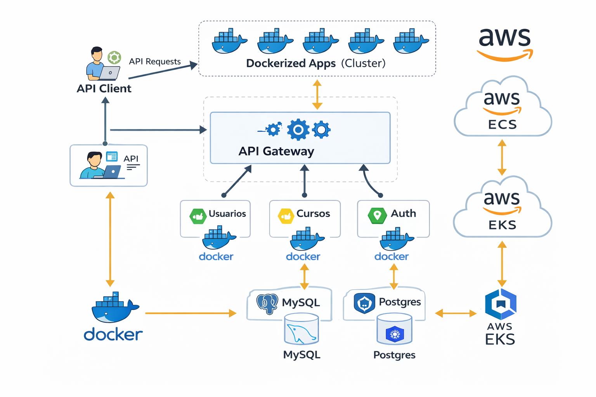

# 🚀 Microservices Platform with Spring Boot, Kubernetes & AWS

## 📌 Overview

This project implements a **cloud-native microservices platform** built with Spring Boot and Spring Cloud, designed to demonstrate **scalable, resilient, and production-oriented architecture patterns**.

It showcases the full lifecycle of modern backend systems:

* Service decomposition
* Inter-service communication
* Containerization
* Orchestration
* Cloud deployment strategies

The system is deployable both locally and in AWS using **ECS (container-based)** and **EKS (Kubernetes-based)** approaches.

---

## 🧱 Architecture
### 📊 Architecture Diagram



### 🔄 Request Flow

1. Client sends request to API Gateway
2. Gateway routes request to appropriate microservice
3. Authentication handled via OAuth2 (JWT)
4. Service communicates with other services via Feign (if needed)
5. Each service interacts with its own database
6. Response is returned through the Gateway
---


### Services

* **msvc-usuarios** → User domain management
* **msvc-cursos** → Course domain management
* **msvc-auth** → Authentication & authorization (OAuth2)
* **msvc-gateway** → API Gateway (Spring Cloud Gateway)

### Key Architectural Patterns

* **API Gateway Pattern** → Centralized routing, security, and cross-cutting concerns
* **Database per Service** → Each microservice owns its persistence layer
* **Service-to-Service Communication** → OpenFeign-based HTTP clients
* **Externalized Configuration** → ConfigMaps and environment variables
* **Stateless Services** → Enables horizontal scalability

---

## ☁️ Cloud Deployment Strategy

This project demonstrates two different deployment models:

### 🐳 ECS (Elastic Container Service)

* Simpler orchestration model
* Suitable for small-to-medium workloads
* Faster setup with fewer operational concerns

### ☸️ EKS (Elastic Kubernetes Service)

* Full Kubernetes-based deployment
* Declarative infrastructure using manifests
* Advanced scalability and orchestration capabilities

**Trade-off:**

| ECS                            | EKS                       |
| ------------------------------ | ------------------------- |
| Simpler                        | More flexible             |
| Lower operational overhead     | Higher control            |
| Limited orchestration features | Full Kubernetes ecosystem |

---

## 🐳 Containerization (Docker)

Each microservice is containerized using optimized Dockerfiles.

Run locally:

```bash
docker-compose up --build
```

Includes:

* Multi-container setup
* Network configuration
* Database containers (MySQL, PostgreSQL)

---
## ▶️ Running Locally

1. Build all services:
   ```bash
   mvn clean install
   ```
2. Start the infrastructure:
```bash
   docker-compose up --build
   ```
3. Access via API Gateway:
```bash
   http://localhost:<port>
   ```

---

## ☸️ Kubernetes Orchestration

Deployment is fully declarative using Kubernetes manifests:

```bash
kubectl apply -f .
```

### Resources Included:

* Deployments (stateless services)
* Services (internal + external exposure)
* ConfigMaps (configuration management)
* Secrets (sensitive data handling)
* Persistent Volumes (data persistence)

### Scalability

* Horizontal scaling via replicas
* Load balancing via Kubernetes Services

---

## 🔐 Security

* OAuth2-based authentication (Spring Authorization Server)
* JWT token-based authorization
* Secured endpoints via Spring Security
* Token propagation between services

---

## ⚙️ Tech Stack

* **Java 17**
* **Spring Boot**
* **Spring Cloud**
* **Spring Security (OAuth2 + JWT)**
* **Spring Data JPA**
* **MySQL / PostgreSQL**
* **Docker**
* **Kubernetes**
* **AWS (ECS, EKS)**

---

## 📡 API Endpoints (Examples)

* `GET /api/usuarios`
* `POST /api/auth/login`
* `GET /api/cursos`

---
## 🧩 Architecture Highlights

- Decoupled microservices with independent databases
- Centralized authentication using OAuth2 (JWT)
- API Gateway for routing and security
- Containerized services for environment consistency
- Kubernetes orchestration for scalability and resilience


## 🧠 Key Engineering Concepts

* Microservices architecture design
* API Gateway pattern
* Distributed system communication
* Containerization and orchestration
* Cloud-native deployment strategies
* Security in distributed systems

---

## ⚖️ Design Decisions & Trade-offs

### Why API Gateway?

To centralize:

* Authentication
* Routing
* Cross-cutting concerns

Trade-off: introduces a single entry point (potential bottleneck if not scaled properly).

---

### Why Kubernetes over ECS?

Kubernetes provides:

* Fine-grained control
* Declarative infrastructure
* Better scalability mechanisms

Trade-off: higher complexity and operational overhead.

---

### Why Database per Service?

* Loose coupling
* Independent scaling
* Domain ownership

Trade-off: increased complexity in data consistency and transactions.

---

## 📈 Scalability Considerations

* Stateless services enable horizontal scaling
* Kubernetes replicas for load distribution
* Independent scaling per service
* Database scaling can be handled separately

---

## 🔮 Future Improvements

* Observability (Prometheus + Grafana)
* Distributed tracing (OpenTelemetry)
* Circuit breakers & resilience (Resilience4j)
* CI/CD pipelines (GitHub Actions)
* Infrastructure as Code (Terraform)

---

## 👨‍💻 Author

Developed by **Freyder Otalvaro**

---
